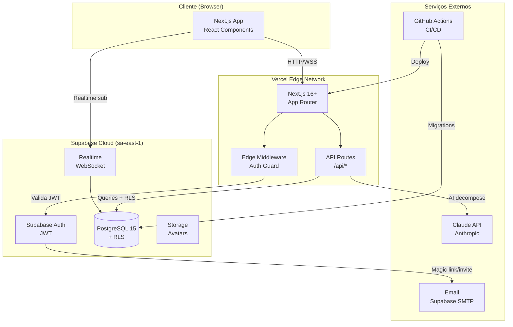
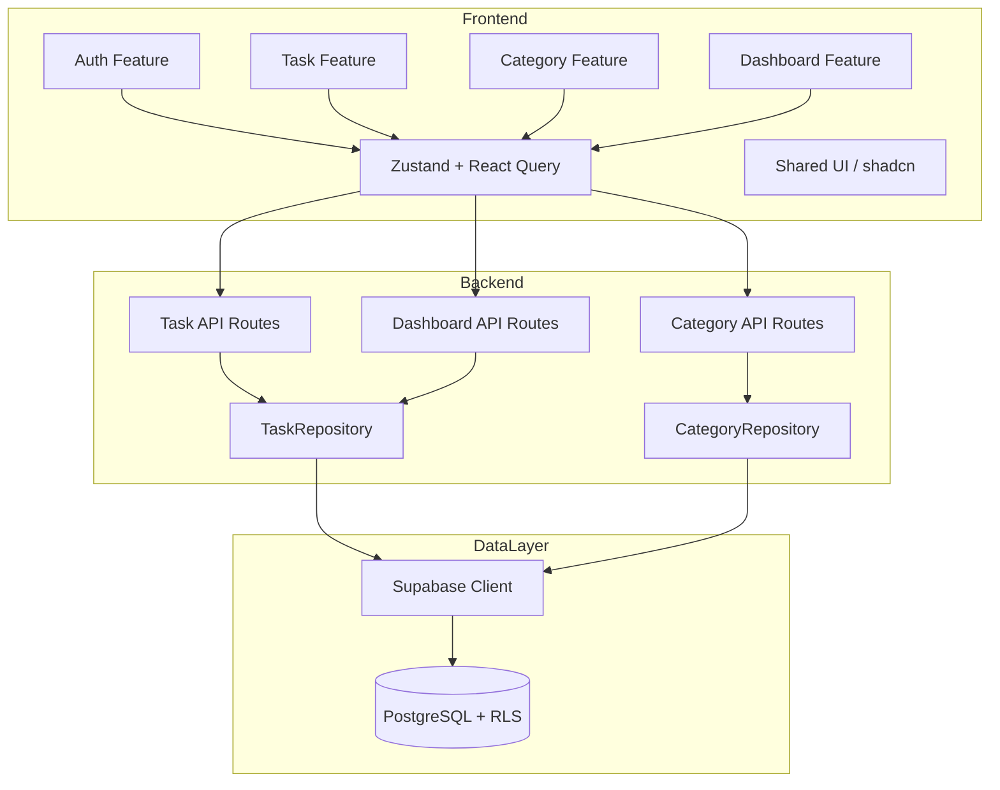
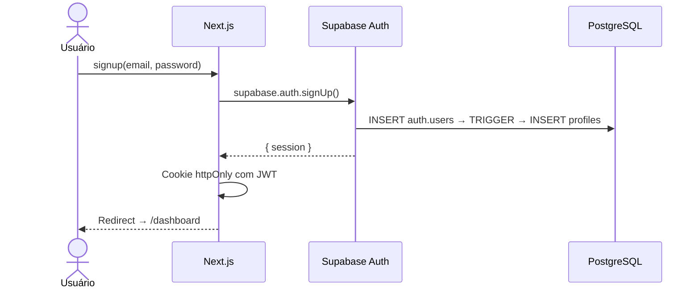
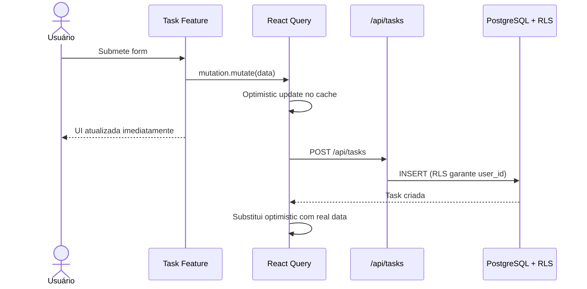
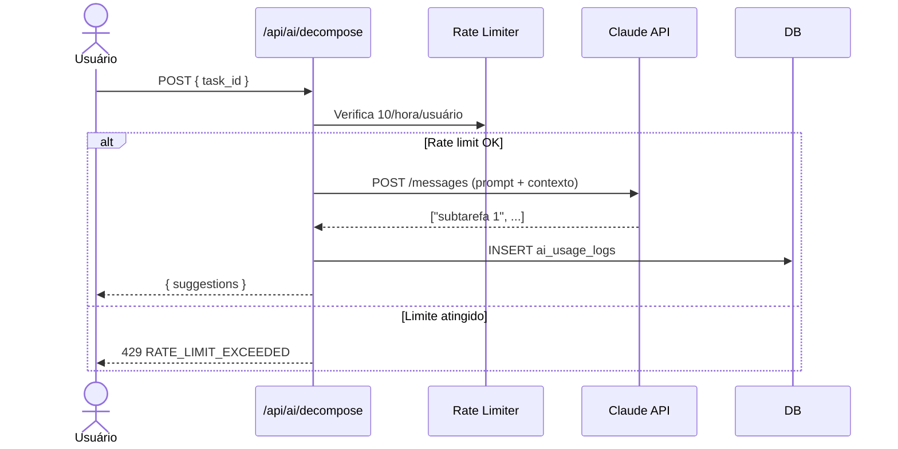

# Task Manager — Fullstack Architecture Document

> **Version:** 1.0 | **Date:** 2026-02-18 | **Author:** @architect (Aria) | **Status:** Draft

---

## Change Log

| Date | Version | Description | Author |
|------|---------|-------------|--------|
| 2026-02-18 | 1.0 | Versão inicial completa | @architect (Aria) |

---

## 1. Introduction

Este documento define a arquitetura fullstack completa do **Task Manager**, cobrindo sistemas de backend, implementação de frontend e suas integrações. Serve como fonte única da verdade para o desenvolvimento orientado por agentes de IA no Synkra AIOS, garantindo consistência em toda a stack tecnológica.

**Starter Template:** N/A — Projeto greenfield. Next.js 16+ inicializado via `create-next-app` com App Router, TypeScript e Tailwind CSS.

---

## 2. High Level Architecture

### Technical Summary

O Task Manager é uma aplicação **Jamstack fullstack** com Next.js 16+ App Router. Frontend híbrido com Server Components para rendering inicial e Client Components para interatividade. Backend via API Routes serverless. Supabase provê PostgreSQL gerenciado, autenticação JWT e RLS. Infraestrutura completamente serverless: Vercel + Supabase Cloud + GitHub Actions CI/CD.

### Platform and Infrastructure

**Plataforma:** Vercel + Supabase Cloud | **Região:** `sa-east-1` (São Paulo)

**Serviços:** Vercel (Hosting, Edge, Previews), Supabase (PostgreSQL 15, Auth JWT, RLS, Storage), GitHub Actions (CI/CD), Sentry (Error Tracking)

### Repository Structure

Monorepo single-package (Next.js nativo). Feature-based organization dentro de `src/`.

### High Level Architecture Diagram



### Architectural Patterns

- **Jamstack + Serverless** — Next.js API Routes serverless, escala automaticamente
- **Feature-Based Architecture** — Código organizado por domínio, cada story do AIOS opera em feature isolada
- **Contract Pattern** — Interfaces TypeScript públicas entre features (`auth.contract.ts`)
- **Repository Pattern** — Camada de acesso a dados abstraída em `lib/repositories/`
- **Server/Client Split** — Server Components para data fetching, Client Components para interatividade
- **Optimistic Updates** — React Query com mutações otimistas para UX fluída
- **RLS as Authorization Layer** — Segurança garantida no banco independente de bugs na API

---

## 3. Tech Stack

| Categoria | Tecnologia | Versão | Propósito | Rationale |
|-----------|-----------|--------|-----------|-----------|
| Frontend Language | TypeScript | 5.x | Tipagem estática | Type safety cross-stack |
| Frontend Framework | Next.js | 16+ | Framework fullstack | App Router unifica front/back |
| UI Components | shadcn/ui | latest | Componentes acessíveis | WCAG AA nativo, sem lock-in |
| State Management | Zustand | 5.x | Estado global cliente | Mínimo boilerplate |
| Server State | TanStack Query | 5.x | Cache e sync servidor | Optimistic updates, invalidation |
| Backend Language | TypeScript | 5.x | API Routes | Tipos compartilhados |
| Backend Framework | Next.js API Routes | 16+ | Endpoints REST serverless | Sem servidor extra |
| API Style | REST | — | Comunicação client-server | Simples, testável |
| Validação | Zod | 3.x | Schemas compartilhados | Single source of truth |
| Forms | React Hook Form | 7.x | Gerenciamento de forms | Performance + integração Zod |
| Database | PostgreSQL 15 | 15 | Banco relacional | Via Supabase; RLS nativo |
| BaaS | Supabase | 2.x | PostgreSQL + Auth + Storage | Auth JWT + RLS prontos |
| File Storage | Supabase Storage | — | Avatars de usuários | Integrado ao Supabase |
| Autenticação | Supabase Auth | — | JWT + session management | Email/senha no MVP |
| Drag & Drop | @dnd-kit/core | 6.x | Reordenação de tarefas | Acessível, touch-friendly |
| Ícones | Lucide React | latest | Biblioteca de ícones | Tree-shakeable |
| Datas | date-fns | 3.x | Manipulação de datas | Leve, tree-shakeable |
| CSS Framework | Tailwind CSS | 4.x | Utility-first styling | Preset ativo |
| Frontend Tests | Vitest + RTL | 2.x | Testes unitários | Mesmo runner do backend |
| Backend Tests | Vitest | 2.x | Testes de API Routes | Fast, ESM-compatible |
| E2E Tests | Playwright | 1.x | Fluxos críticos | Multi-browser, CI-friendly |
| Build Tool | Next.js CLI | 16+ | Build de produção | Zero config |
| Bundler | Turbopack | — | Bundle de desenvolvimento | 10x mais rápido em dev |
| IaC / Migrations | Supabase CLI | 2.x | Schema e migrations | Versionado em `supabase/migrations/` |
| CI/CD | GitHub Actions | — | Pipeline automático | Integração nativa Vercel + Supabase |
| Error Tracking | Sentry | 8.x | Monitoramento de erros | SDK Next.js disponível |
| Analytics | Vercel Analytics | — | Métricas e performance | Zero config, Core Web Vitals |
| Logging | Structured logs | — | Logs de API | JSON estruturado |
| Linting | ESLint + Prettier | — | Qualidade de código | Configurado no preset |

---

## 4. Data Models

### Profile
```typescript
export interface Profile {
  id: string; email: string; full_name: string | null;
  avatar_url: string | null; created_at: string; updated_at: string;
}
export type ProfileUpdate = Pick<Profile, 'full_name' | 'avatar_url'>;
```

### Task
```typescript
export type TaskPriority = 'low' | 'medium' | 'high' | 'urgent';
export type TaskStatus   = 'todo' | 'in_progress' | 'done';

export interface Task {
  id: string; user_id: string; workspace_id: string | null;
  assignee_id: string | null; title: string; description: string | null;
  due_date: string | null; priority: TaskPriority; status: TaskStatus;
  position: number; deleted_at: string | null;
  created_at: string; updated_at: string;
  categories?: Category[]; subtasks?: Subtask[]; assignee?: Profile;
}
export type TaskCreate = Pick<Task, 'title' | 'description' | 'due_date' | 'priority' | 'status'>
  & { category_ids?: string[] };
export type TaskUpdate = Partial<TaskCreate> & { position?: number };
export type TaskSummary = Pick<Task, 'id' | 'title' | 'priority' | 'status' | 'due_date' | 'position' | 'deleted_at'>
  & { categories: Pick<Category, 'id' | 'name' | 'color'>[] };
```

### Category
```typescript
export interface Category {
  id: string; user_id: string; name: string; color: string;
  created_at: string; updated_at: string; task_count?: number;
}
export type CategoryCreate = Pick<Category, 'name' | 'color'>;
```

### Subtask *(Epic 4)*
```typescript
export interface Subtask {
  id: string; task_id: string; title: string;
  status: 'todo' | 'done'; position: number;
  created_at: string; updated_at: string;
}
```

### DashboardStats *(view — não persiste)*
```typescript
export interface DashboardStats {
  total: number; todo: number; in_progress: number; done: number; overdue: number;
  due_today: TaskSummary[]; upcoming: TaskSummary[];
  activity: { date: string; completed: number }[];
}
```

### Entity Relationship Diagram

```mermaid
erDiagram
    PROFILES { uuid id PK; text email; text full_name; text avatar_url }
    TASKS { uuid id PK; uuid user_id FK; uuid workspace_id FK; text title; enum priority; enum status; int position; timestamp deleted_at }
    CATEGORIES { uuid id PK; uuid user_id FK; text name; text color }
    TASK_CATEGORIES { uuid task_id FK; uuid category_id FK }
    SUBTASKS { uuid id PK; uuid task_id FK; text title; enum status; int position }

    PROFILES ||--o{ TASKS : "owns"
    PROFILES ||--o{ CATEGORIES : "owns"
    TASKS ||--o{ TASK_CATEGORIES : "has"
    CATEGORIES ||--o{ TASK_CATEGORIES : "tagged_by"
    TASKS ||--o{ SUBTASKS : "contains"
```

---

## 5. API Specification

**Base URL:** `/api` | **Auth:** Bearer JWT em todas as rotas autenticadas

```typescript
interface ApiResponse<T> { data: T; meta?: { total?: number; page?: number } }
interface ApiError { error: { code: string; message: string; details?: Record<string, string[]> } }
```

| Método | Endpoint | Descrição |
|--------|----------|-----------|
| GET | `/api/health` | Status (público) |
| GET/PATCH | `/api/profile` | Perfil do usuário |
| GET | `/api/tasks` | Lista com filtros: status, priority, category_id, due, search, page, limit |
| POST | `/api/tasks` | Cria tarefa → 201 |
| GET | `/api/tasks/trash` | Tarefas deletadas |
| PATCH | `/api/tasks/reorder` | Bulk reorder positions → 204 |
| GET/PATCH/DELETE | `/api/tasks/:id` | CRUD por ID |
| POST | `/api/tasks/:id/restore` | Restaura da lixeira |
| GET/POST | `/api/tasks/:id/subtasks` | Subtarefas (Epic 4) |
| PATCH/DELETE | `/api/tasks/:id/subtasks/:sid` | Subtarefa individual |
| GET | `/api/categories` | Lista com task_count |
| POST | `/api/categories` | Cria → 201 |
| PATCH/DELETE | `/api/categories/:id` | Atualiza/Remove |
| GET | `/api/dashboard/stats` | Métricas agregadas |
| POST | `/api/ai/decompose` | IA: decomposição (Epic 4, rate: 10/hora) |

---

## 6. Components



**Componentes principais:** Auth Feature (contract + hooks + store), Task Feature (list/card/drawer/filters), Category Feature (CRUD + select), Dashboard Feature (stats + chart), TaskRepository (data access), Shared UI (shadcn/ui base components)

---

## 7. External APIs

| API | Propósito | Auth | Notas |
|-----|-----------|------|-------|
| Supabase Auth | Login/signup/session | anon key + service role | Integrado via SDK |
| Supabase Storage | Avatars | JWT usuário | Bucket `avatars` público, max 5MB |
| Claude API (Epic 4) | Decomposição de tarefas | `ANTHROPIC_API_KEY` server-only | Modelo: `claude-haiku-4-5`, rate limit próprio |

---

## 8. Core Workflows

### Auth Flow


### Task Create (Optimistic Update)


### AI Decomposition *(Epic 4)*


---

## 9. Database Schema

```sql
-- Extensões
CREATE EXTENSION IF NOT EXISTS "uuid-ossp";
CREATE EXTENSION IF NOT EXISTS "pg_trgm";

-- Profiles (estende auth.users)
CREATE TABLE profiles (
  id UUID PRIMARY KEY REFERENCES auth.users(id) ON DELETE CASCADE,
  email TEXT NOT NULL, full_name TEXT, avatar_url TEXT,
  created_at TIMESTAMPTZ DEFAULT NOW(), updated_at TIMESTAMPTZ DEFAULT NOW()
);
CREATE OR REPLACE FUNCTION handle_new_user() RETURNS TRIGGER AS $$
BEGIN INSERT INTO profiles (id, email) VALUES (NEW.id, NEW.email); RETURN NEW; END;
$$ LANGUAGE plpgsql SECURITY DEFINER;
CREATE TRIGGER on_auth_user_created AFTER INSERT ON auth.users FOR EACH ROW EXECUTE FUNCTION handle_new_user();

-- Tipos ENUM
CREATE TYPE task_priority AS ENUM ('low', 'medium', 'high', 'urgent');
CREATE TYPE task_status AS ENUM ('todo', 'in_progress', 'done');

-- Categories
CREATE TABLE categories (
  id UUID PRIMARY KEY DEFAULT uuid_generate_v4(),
  user_id UUID NOT NULL REFERENCES profiles(id) ON DELETE CASCADE,
  name TEXT NOT NULL CHECK (char_length(name) <= 50),
  color TEXT NOT NULL DEFAULT '#3B82F6',
  created_at TIMESTAMPTZ DEFAULT NOW(), updated_at TIMESTAMPTZ DEFAULT NOW()
);

-- Tasks
CREATE TABLE tasks (
  id UUID PRIMARY KEY DEFAULT uuid_generate_v4(),
  user_id UUID NOT NULL REFERENCES profiles(id) ON DELETE CASCADE,
  workspace_id UUID, assignee_id UUID,
  title TEXT NOT NULL CHECK (char_length(title) >= 3),
  description TEXT, due_date DATE,
  priority task_priority NOT NULL DEFAULT 'medium',
  status task_status NOT NULL DEFAULT 'todo',
  position INTEGER NOT NULL DEFAULT 0, deleted_at TIMESTAMPTZ,
  created_at TIMESTAMPTZ DEFAULT NOW(), updated_at TIMESTAMPTZ DEFAULT NOW()
);
CREATE INDEX idx_tasks_user_id ON tasks(user_id);
CREATE INDEX idx_tasks_status ON tasks(status) WHERE deleted_at IS NULL;
CREATE INDEX idx_tasks_due_date ON tasks(due_date) WHERE deleted_at IS NULL;
CREATE INDEX idx_tasks_position ON tasks(user_id, position) WHERE deleted_at IS NULL;
CREATE INDEX idx_tasks_search ON tasks USING GIN (to_tsvector('portuguese', title || ' ' || COALESCE(description, '')));

-- Task Categories
CREATE TABLE task_categories (
  task_id UUID NOT NULL REFERENCES tasks(id) ON DELETE CASCADE,
  category_id UUID NOT NULL REFERENCES categories(id) ON DELETE CASCADE,
  created_at TIMESTAMPTZ DEFAULT NOW(),
  PRIMARY KEY (task_id, category_id)
);

-- Subtasks (Epic 4)
CREATE TABLE subtasks (
  id UUID PRIMARY KEY DEFAULT uuid_generate_v4(),
  task_id UUID NOT NULL REFERENCES tasks(id) ON DELETE CASCADE,
  title TEXT NOT NULL, status TEXT NOT NULL DEFAULT 'todo' CHECK (status IN ('todo', 'done')),
  position INTEGER NOT NULL DEFAULT 0,
  created_at TIMESTAMPTZ DEFAULT NOW(), updated_at TIMESTAMPTZ DEFAULT NOW()
);

-- AI Usage Logs (Epic 4)
CREATE TABLE ai_usage_logs (
  id UUID PRIMARY KEY DEFAULT uuid_generate_v4(),
  user_id UUID NOT NULL REFERENCES profiles(id) ON DELETE CASCADE,
  task_id UUID REFERENCES tasks(id) ON DELETE SET NULL,
  action TEXT NOT NULL DEFAULT 'decompose', tokens_used INTEGER,
  created_at TIMESTAMPTZ DEFAULT NOW()
);

-- RLS
ALTER TABLE profiles ENABLE ROW LEVEL SECURITY;
ALTER TABLE categories ENABLE ROW LEVEL SECURITY;
ALTER TABLE tasks ENABLE ROW LEVEL SECURITY;
ALTER TABLE task_categories ENABLE ROW LEVEL SECURITY;
ALTER TABLE subtasks ENABLE ROW LEVEL SECURITY;

CREATE POLICY "profiles_own" ON profiles USING (auth.uid() = id);
CREATE POLICY "categories_own" ON categories USING (auth.uid() = user_id);
CREATE POLICY "tasks_own" ON tasks USING (auth.uid() = user_id AND workspace_id IS NULL);
CREATE POLICY "task_categories_own" ON task_categories
  USING (EXISTS (SELECT 1 FROM tasks WHERE tasks.id = task_id AND tasks.user_id = auth.uid()));
CREATE POLICY "subtasks_own" ON subtasks
  USING (EXISTS (SELECT 1 FROM tasks WHERE tasks.id = task_id AND tasks.user_id = auth.uid()));
```

> **@data-engineer:** Revisar índices adicionais, políticas RLS para workspace (Epic 3), triggers de `updated_at` e strategy de migrations incrementais.

---

## 10. Frontend Architecture

### Project Structure
```
src/
├── app/
│   ├── (auth)/login/ signup/
│   ├── (dashboard)/ layout.tsx
│   │   ├── dashboard/ tasks/ tasks/trash/ categories/ settings/
│   └── api/ health/ profile/ tasks/ categories/ dashboard/ ai/
├── features/
│   ├── auth/ { auth.contract.ts, components/, hooks/, store/ }
│   ├── tasks/ { components/, hooks/, schemas/ }
│   ├── categories/ { components/, hooks/ }
│   └── dashboard/ { components/, hooks/ }
├── lib/ { repositories/, schemas/, supabase/ }
├── components/ui/        # shadcn/ui
├── types/                # Interfaces globais
└── middleware.ts         # Edge auth guard
```

### State Management
- **Zustand:** Estado global de UI/auth (`useAuthStore`)
- **React Query:** Server state (tasks, categories, stats) com `staleTime: 30s` e optimistic updates
- **React Hook Form + Zod:** Estado de formulários com validação tipada

### Auth Guard (Edge Middleware)
```typescript
// middleware.ts
export async function middleware(req: NextRequest) {
  const supabase = createMiddlewareClient({ req, res })
  const { data: { session } } = await supabase.auth.getSession()
  const isPublic = PUBLIC_ROUTES.some(r => req.nextUrl.pathname.startsWith(r))
  if (!session && !isPublic) return NextResponse.redirect(new URL('/login', req.url))
  if (session && ['/login', '/signup'].includes(req.nextUrl.pathname))
    return NextResponse.redirect(new URL('/dashboard', req.url))
}
```

---

## 11. Backend Architecture

### API Route Pattern
```typescript
// app/api/tasks/[id]/route.ts
export async function PATCH(req: NextRequest, { params }: { params: { id: string } }) {
  const supabase = createRouteHandlerClient({ cookies })
  const { data: { user } } = await supabase.auth.getUser()
  if (!user) return unauthorized()
  const parsed = taskUpdateSchema.safeParse(await req.json())
  if (!parsed.success) return validationError(parsed.error)
  const repo = new TaskRepository(supabase)
  return NextResponse.json({ data: await repo.update(user.id, params.id, parsed.data) })
}
```

### Repository Pattern
```typescript
// lib/repositories/task.repository.ts
export class TaskRepository {
  constructor(private supabase: SupabaseClient) {}
  async list(userId: string, filters: TaskFilters) {
    let q = this.supabase.from('tasks')
      .select('id,title,priority,status,due_date,position,deleted_at,categories:task_categories(category:categories(id,name,color))')
      .eq('user_id', userId).is('deleted_at', null).order('position')
    if (filters.status?.length) q = q.in('status', filters.status)
    if (filters.search) q = q.textSearch('title', filters.search, { type: 'websearch' })
    const { data, count, error } = await q.range(/* pagination */)
    if (error) throw new RepositoryError('list tasks failed', error)
    return { tasks: data as TaskSummary[], total: count ?? 0 }
  }
}
```

### Auth Flow (Double Validation)
1. **Edge Middleware** valida JWT via `getSession()` — bloqueia requests inválidos antes da API
2. **API Route** valida novamente via `getUser()` — garante token fresco server-side
3. **RLS PostgreSQL** — terceira camada, garante isolamento mesmo com bug na API

---

## 12. Unified Project Structure

```
task-manager/
├── .github/workflows/ { ci.yaml, deploy.yaml }
├── supabase/ { migrations/, seed.sql, config.toml }
├── src/ { app/, features/, lib/, components/ui/, types/, middleware.ts }
├── docs/ { brainstorming/, prd/, architecture/ }
├── public/
├── .env.local (não commitado)
├── .env.example
├── next.config.ts
├── tailwind.config.ts
├── tsconfig.json
├── vitest.config.ts
├── playwright.config.ts
└── package.json
```

---

## 13. Development Workflow

### Setup
```bash
npm install
cp .env.example .env.local
npx supabase start
npx supabase db push && npx supabase db seed
npx supabase gen types typescript --local > src/types/database.types.ts
npm run dev
```

### Commands
```bash
npm run dev          # Next.js + Turbopack → localhost:3000
npm run test         # Vitest
npm run test:e2e     # Playwright
npm run lint         # ESLint
npm run typecheck    # tsc --noEmit
npm run build        # Build produção
```

### Environment Variables
```bash
NEXT_PUBLIC_SUPABASE_URL=https://xxx.supabase.co
NEXT_PUBLIC_SUPABASE_ANON_KEY=eyJxxx
SUPABASE_SERVICE_ROLE_KEY=eyJxxx        # server-only
ANTHROPIC_API_KEY=sk-ant-xxx            # server-only (Epic 4)
ENABLE_AI_FEATURES=false                # feature flag
SENTRY_DSN=https://xxx@sentry.io
```

---

## 14. Deployment Architecture

| Ambiente | Frontend | Banco | Propósito |
|----------|---------|-------|-----------|
| Local | `localhost:3000` | Supabase local `:54321` | Desenvolvimento |
| Preview | `task-manager-{pr}.vercel.app` | Supabase dev | Review de PRs |
| Production | `task-manager.vercel.app` | Supabase prod | Live |

### CI/CD Pipeline
```yaml
# .github/workflows/ci.yaml
jobs:
  quality:
    steps:
      - run: npm ci
      - run: npm run lint && npm run typecheck && npm run test
  e2e:
    needs: quality
    steps:
      - run: npm run build && npm run test:e2e
```

Deploy automático via Vercel GitHub Integration. Migrations via `supabase db push --linked` no workflow de deploy.

---

## 15. Security and Performance

### Security
- JWT em cookies `httpOnly; Secure; SameSite=Lax`
- Validação Zod em todas as API Routes
- RLS como segunda camada (banco protege mesmo se API falhar)
- `SUPABASE_SERVICE_ROLE_KEY` e `ANTHROPIC_API_KEY` apenas server-side
- Rate limiting no `/api/ai/decompose` (10/hora/usuário)
- CSP Headers via `next.config.ts`

### Performance
- Bundle target: < 200KB First Load JS
- Server Components para listagens (zero JS extra)
- `staleTime: 30s` no React Query
- Paginação server-side (20 items/página)
- `TaskSummary` nas listagens (SELECT apenas colunas necessárias)
- Índice GIN `pg_trgm` para full-text search
- Índices compostos `(user_id, position)` e `(status)` com partial index

---

## 16. Testing Strategy

```
        ┌──────────────────┐
        │   E2E Playwright  │  10% — auth, CRUD, drag-drop
       ┌┴──────────────────┴┐
       │  Integration Vitest │  30% — API Routes + Supabase local
      ┌┴────────────────────┴┐
      │  Unit Vitest + RTL   │  60% — componentes, hooks, schemas
      └──────────────────────┘
```

**Cobertura mínima:** 80% em lógica crítica (auth, CRUD, RLS) — NFR6

**Exemplos:**
```typescript
// Unit
it('exibe badge vermelho para tarefas atrasadas', () => {
  render(<TaskCard task={{ ...mock, due_date: '2020-01-01', status: 'todo' }} />)
  expect(screen.getByRole('article')).toHaveClass('border-red-200')
})

// E2E
test('cria tarefa e aparece na lista', async ({ page }) => {
  await page.goto('/tasks')
  await page.getByRole('button', { name: 'Nova Tarefa' }).click()
  await page.getByLabel('Título').fill('Minha tarefa')
  await page.getByRole('button', { name: 'Criar' }).click()
  await expect(page.getByText('Minha tarefa')).toBeVisible()
})
```

---

## 17. Coding Standards

### Regras Críticas
- **Type Sharing:** Tipos em `src/types/` — nunca duplicar interfaces entre features
- **No Direct Supabase in Components:** Apenas via hooks/repositories
- **Zod First:** Toda entrada (forms + API bodies) passa por schema Zod
- **Server Default:** Componentes são Server Components por padrão — `'use client'` explícito quando necessário
- **Error Boundaries:** Toda página tem `error.tsx`
- **No Magic Numbers:** Constantes em `lib/constants.ts`

### Naming Conventions
| Elemento | Convenção | Exemplo |
|----------|-----------|---------|
| Componentes | PascalCase | `TaskCard.tsx` |
| Hooks | camelCase + `use` | `useTaskList.ts` |
| Stores | camelCase + `.store` | `auth.store.ts` |
| Repositórios | PascalCase + `Repository` | `TaskRepository` |
| Schemas Zod | camelCase + `Schema` | `taskCreateSchema` |
| Tabelas DB | snake_case plural | `task_categories` |
| ENV públicas | `NEXT_PUBLIC_` prefix | `NEXT_PUBLIC_SUPABASE_URL` |

---

## 18. Error Handling Strategy

```typescript
// Formato padrão de erro
interface ApiError {
  error: { code: string; message: string; details?: Record<string, string[]> }
}

// Helpers centralizados (lib/api-helpers.ts)
const unauthorized = () => NextResponse.json({ error: { code: 'UNAUTHORIZED', message: 'Authentication required' } }, { status: 401 })
const notFound = (code: string) => NextResponse.json({ error: { code, message: 'Not found' } }, { status: 404 })
const validationError = (err: ZodError) => NextResponse.json({ error: { code: 'VALIDATION_ERROR', details: err.flatten().fieldErrors } }, { status: 422 })

// Frontend — React Query onError global
const queryClient = new QueryClient({
  defaultOptions: { mutations: { onError: (e) => toast.error(e.message) } }
})
```

---

## 19. Monitoring and Observability

| Ferramenta | Camada | Propósito |
|-----------|--------|-----------|
| Sentry | Frontend + API | Error tracking, stack traces |
| Vercel Analytics | Frontend | Core Web Vitals, TTFB, FCP |
| Vercel Logs | API Routes | Logs JSON estruturados |
| Supabase Dashboard | Database | Query performance, connections, RLS denials |

**Alertas:** Error rate > 1% por endpoint, Response time p95 > 500ms, Rate limit hits em `/api/ai/decompose`

---

## 20. Checklist Results

*(A executar via `*execute-checklist architect-checklist.md`)*

---

## Next Steps

### Para @data-engineer
> Use este documento (Seção 9 — Database Schema) como base para criar o schema detalhado com DDL completo, políticas RLS refinadas, triggers de `updated_at`, índices adicionais e plano de migrations incrementais. Execute `*db-schema-audit` após implementação.

### Para @sm (River)
> PRD (`docs/prd/task-manager-prd.md`) e Arquitetura (`docs/architecture/task-manager-architecture.md`) estão prontos. Crie as stories do Epic 1 usando `*create-next-story`. Comece pela Story 1.1 (Project Setup & CI/CD Pipeline).

### Para @dev (Dex)
> Aguarde stories criadas pelo @sm. Ao iniciar, use o preset `nextjs-react` como referência e siga os padrões definidos neste documento (Feature-Based, Repository Pattern, Contract Pattern).

---

*Gerado por @architect (Aria) — Synkra AIOS v4.2.13*
